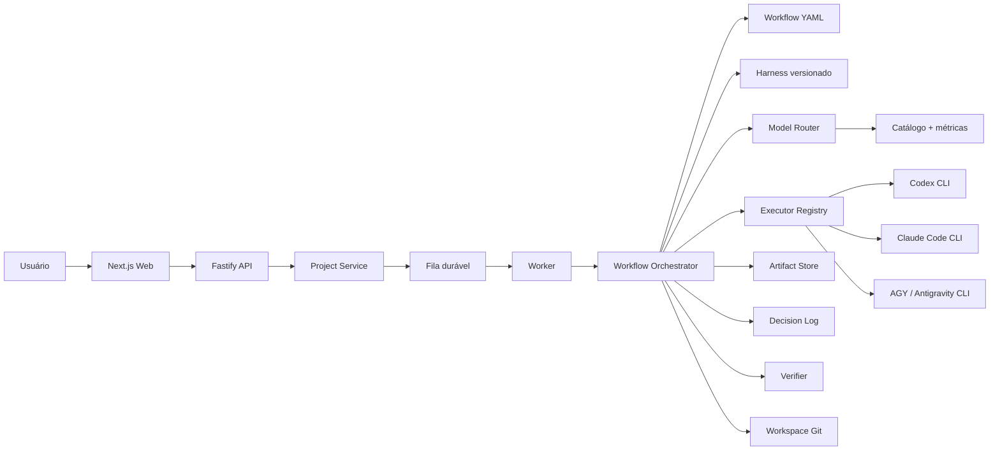

# Agent Foundry

Um monorepo TypeScript para transformar um PRD em um workflow auditável de agentes de software.

O sistema recebe um PRD pela interface web, persiste um projeto, enfileira uma execução e conduz uma sequência declarativa de planejamento, revisão, arquitetura, implementação, reparo e verificação. Cada etapa produz artefatos revisionados, decisões, eventos, métricas e checkpoints Git. O executor pode ser Codex CLI, Claude Code CLI ou AGY, a CLI do Google Antigravity.

> **Estado:** MVP executável. O modo `mock` roda o fluxo inteiro sem CLIs externas. O modo `real` usa suas sessões autenticadas das três CLIs.

## O que está incluído

- UI Next.js para criar projetos e acompanhar a execução.
- API Fastify para projetos, artefatos, workflows e diagnóstico dos executores.
- Worker separado ou embutido na API para desenvolvimento local.
- Orquestrador orientado a artefatos, sem depender de memória volátil entre agentes.
- Workflows YAML com quality gates, reparos e limite de iterações.
- Harness versionado com regras globais, papéis, stack e padrões de qualidade.
- Model router com score por tarefa, risco, contexto, velocidade, custo/quota, confiabilidade e histórico observado.
- Adaptadores para `codex`, `claude` e `agy`.
- Fallback de modelos entre providers, com checkpoint e rollback Git antes de nova tentativa.
- Verificação determinística via scripts do projeto gerado e `git diff --check`.
- Persistência local em arquivos atômicos, JSONL e fila durável em diretórios.
- Decision log, run records, eventos e métricas de aprovação por reviewer.
- Auditoria distinta de modelo selecionado, candidatos tentados e modelo realmente executado.
- Testes unitários e integração completa em modo mock.

## Visão geral



O orquestrador não chama um fornecedor diretamente. Ele pede uma decisão ao router, obtém um executor pela interface comum, persiste o resultado e avança o estado do workflow. Isso evita acoplamento entre o fluxo de negócio e uma CLI específica.

## Início rápido em modo mock

### Pré-requisitos

- Node.js 22 ou superior.
- Git.
- Para modo real com AGY: Antigravity CLI 1.1.1 ou superior.

```bash
cp .env.example .env
npm ci
npm run doctor
npm run dev:inline
```

Abra `http://localhost:3000`.

O modo mock cria um projeto mínimo no workspace, atravessa todos os quality gates e executa os checks configurados. Ele serve para validar a mecânica do sistema. Não mede a qualidade real dos modelos.

### Processos separados

```bash
npm run dev
```

Isso inicia API, worker e web. Para a versão mais simples de desenvolvimento, `npm run dev:inline` embute o worker na API.

## Uso com as CLIs reais

Instale as CLIs pelos canais oficiais:

```bash
# OpenAI Codex CLI
curl -fsSL https://chatgpt.com/codex/install.sh | sh

# Anthropic Claude Code
curl -fsSL https://claude.ai/install.sh | bash

# Google Antigravity CLI
curl -fsSL https://antigravity.google/cli/install.sh | bash
```

Depois, execute cada comando interativamente uma vez e autentique sua assinatura:

```bash
codex
claude
agy
```

Confira o ambiente:

```bash
cp .env.example .env
# Edite .env e defina EXECUTOR_MODE=real
npm run doctor
npm run dev
```

O catálogo não fixa nomes atuais para os modelos padrão de Codex ou AGY. Quando `CODEX_DEFAULT_MODEL` ou `AGY_DEFAULT_MODEL` ficam vazios, a respectiva CLI usa seu modelo configurado. Para cadastrar tiers adicionais do AGY, consulte os nomes disponíveis com:

```bash
agy models
```

O adapter do AGY exige a versão 1.1.1 ou superior, pois depende de `--model`, `--mode` e do sandbox corrigido no modo headless.

A sintaxe e os aliases das CLIs podem mudar. Os adaptadores estão isolados em `packages/executors`, para que uma alteração de fornecedor não contamine o domínio ou o orquestrador.

## Ciclo de uma execução

1. `POST /projects` valida o nome, PRD e workflow.
2. `ProjectService` cria o workspace e grava `PRD.md`.
3. O projeto e o artefato `prd` são persistidos.
4. Um job `run-project` entra na fila.
5. O worker reivindica o job por rename atômico.
6. O orquestrador lê o workflow YAML.
7. Para cada etapa, ele carrega artefatos de entrada e seleciona o harness relevante.
8. `TaskProfiler` estima contexto, saída, complexidade, risco e prioridades.
9. `ModelRouter` ranqueia os modelos, diversifica os primeiros fallbacks por provider e grava a decisão completa no artefato.
10. O executor recebe prompt, schema de saída e caminho do workspace.
11. A resposta é validada por Zod e persistida como nova revisão.
12. Reviewers aprovam ou acionam reparos, com limite explícito de iterações.
13. Etapas mutáveis usam checkpoint Git. Uma tentativa falha é revertida antes do fallback.
14. Métricas de execução e aprovação alimentam decisões futuras do router.

O workflow padrão produz, entre outros:

- `prd`
- `plan.current` e `plan.review`
- `architecture.current` e `architecture.review`
- `implementation.report` e `code.review`
- `verification.report`
- `release.review`
- `decision-log`
- artefatos de auditoria `run.*`

## Estrutura do monorepo

```text
apps/
  api/                 Fastify HTTP API
  web/                 Next.js App Router UI
  worker/              consumidor da fila
packages/
  composition/         composição e configuração do runtime
  contracts/           schemas Zod e tipos compartilhados
  domain/              portas, erros e utilitários sem infraestrutura
  executors/           Codex, Claude, AGY, mock e verifier
  harness/             seleção do conhecimento versionado
  model-router/        catálogo, score e decisão de modelo
  orchestrator/        workflow engine, prompts e project service
  persistence/         arquivos, fila, eventos, métricas, Git e artefatos
harness/                conteúdo versionado entregue aos agentes
models/catalog.yaml     modelos e priors editáveis
workflows/              pipelines declarativos
```

As dependências apontam para dentro: aplicações compõem pacotes; domínio e contratos não conhecem Fastify, Next.js nem as CLIs.

## Model router

Cada tarefa vira um `TaskProfile` com:

- papel e tipo da tarefa;
- complexidade e risco;
- tamanho estimado de contexto e resposta;
- necessidade de escrever no workspace;
- prioridade relativa de qualidade, velocidade, custo e confiabilidade;
- tags desejadas e provedores permitidos.

O router primeiro aplica restrições duras, como janela de contexto e permissão para alterar arquivos. Depois calcula um score auditável para cada candidato.

Os números de `models/catalog.yaml` são **priors subjetivos**, não benchmarks oficiais. Nomes explícitos de modelos ficam em variáveis de ambiente, porque disponibilidade e aliases podem variar por conta. O sistema combina esses priors com:

- taxa de sucesso operacional;
- duração observada por papel e tarefa;
- aprovações ou reprovações dos quality gates;
- falhas consecutivas recentes;
- usage e custo reportados pela CLI, quando disponíveis.

Como as assinaturas normalmente não expõem um custo marginal confiável por chamada, `costEfficiency` deve representar consumo de quota e custo de oportunidade. Para modelos cobrados por token, você pode adicionar `billingMode: metered` e `pricing` ao catálogo. Veja [docs/MODEL_ROUTING.md](docs/MODEL_ROUTING.md).

## Harness

O harness é uma base de conhecimento versionada, não um prompt gigante nem um processo separado. O manifesto seleciona fragmentos por papel, tipo de tarefa, stack e tags.

```text
harness/
  manifest.json
  global/
  roles/
  stacks/
  standards/
  quality/
```

Cada run grava a versão do harness, os arquivos selecionados e o prompt compilado. Isso permite reproduzir por que um agente recebeu determinada instrução.

## Workflows declarativos

`workflows/web-app-v1.yaml` descreve o fluxo sem colocar regras de produto dentro do motor. Os nós suportados são:

- `agent`: executa uma tarefa e produz um artefato.
- `verify`: roda checks determinísticos no workspace.
- `quality-loop`: combina setup, reviewer, reparo, condição de aprovação e limite de iterações.

Criar um novo fluxo não exige alterar o orquestrador. Copie o YAML, mude o ID e defina entradas, saídas e gates.

## Persistência local

Por padrão, tudo fica em `DATA_DIR`:

```text
data/
  metrics/models.json
  queue/{pending,processing,completed,failed}/
  projects/<project-id>/
    project.json
    events.jsonl
    artifacts/
      index.json
      <artifact-name>/<revision>.json
    workspace/
      PRD.md
      .git/
      .orchestrator/runs/<run-id>/
```

Artefatos são imutáveis por revisão e incluem hash SHA-256. O índice só aponta para revisões já gravadas.

## API

| Método | Rota                            | Uso                                  |
| ------ | ------------------------------- | ------------------------------------ |
| `GET`  | `/health`                       | saúde básica                         |
| `GET`  | `/runtime`                      | catálogo e health das CLIs           |
| `GET`  | `/workflows`                    | workflows disponíveis                |
| `GET`  | `/projects`                     | projetos recentes                    |
| `POST` | `/projects`                     | cria e enfileira um projeto          |
| `GET`  | `/projects/:id`                 | projeto, eventos e artefatos atuais  |
| `GET`  | `/projects/:id/artifacts/:name` | artefato por nome e revisão opcional |
| `POST` | `/projects/:id/retry`           | reenfileira projeto com falha        |

Exemplo:

```bash
curl -X POST http://localhost:4000/projects \
  -H 'content-type: application/json' \
  -d @- <<'JSON'
{
  "name": "Issue Radar",
  "workflowId": "web-app-v1",
  "prd": "Crie uma aplicação web para registrar issues, filtrar por prioridade e status, persistir dados e cobrir os fluxos principais com testes."
}
JSON
```

## Comandos

```bash
npm run dev             # API, worker e web
npm run dev:inline      # API com worker embutido + web
npm run doctor          # valida ambiente e CLIs exigidas
npm run typecheck       # TypeScript project references
npm test                # Vitest
npm run build           # todos os pacotes e aplicações
npm run check           # typecheck + testes + build
npm run clean           # remove artefatos de build
npm run models:list:agy # modelos disponíveis no AGY
```

## Docker

O Compose roda em modo mock por padrão:

```bash
docker compose up --build
```

Isso é intencional. O contêiner não instala nem recebe silenciosamente suas credenciais das CLIs. Para modo real, execute o worker no host autenticado ou construa uma imagem dedicada e trate credenciais como segredo operacional. Não monte sua pasta pessoal inteira no contêiner.

## Limitações honestas

Este MVP ainda não é uma plataforma multi-tenant segura nem um scheduler distribuído.

- A fila em arquivos é adequada para um único host e poucos workers, não para alta disponibilidade.
- Não há recuperação automática de leases órfãos na pasta `processing` após crash abrupto.
- O verifier executa scripts do código gerado. Isso exige isolamento forte antes de aceitar usuários não confiáveis.
- As permissões das CLIs continuam fazendo parte da fronteira de segurança. Prompt e sandbox de fornecedor não são uma prisão perfeita.
- Não há autenticação, autorização, rate limit, quota por usuário nem armazenamento de segredos.
- O router melhora com feedback, mas não prova que o modelo escolhido é globalmente ótimo.
- Um reviewer baseado em LLM pode aprovar código ruim. Checks determinísticos e testes continuam obrigatórios.
- Assinatura não significa capacidade ilimitada. Rate limits e políticas do fornecedor ainda se aplicam.

Antes de expor isso publicamente, leia [docs/SECURITY.md](docs/SECURITY.md) e [docs/OPERATIONS.md](docs/OPERATIONS.md).

## Próximos passos de produção

A evolução com maior retorno costuma ser:

1. Isolar cada workspace em microVM ou sandbox efêmero sem credenciais reutilizáveis.
2. Trocar a fila em arquivos por Postgres + leasing ou um broker durável.
3. Adicionar autenticação, tenancy, quotas e políticas por projeto.
4. Guardar logs e métricas em um backend consultável.
5. Criar benchmark próprio com tarefas reais e avaliação cega.
6. Implementar recuperação idempotente de jobs e cancelamento cooperativo.
7. Adicionar streaming de eventos por SSE ou WebSocket.
8. Criar políticas de seleção de contexto para evitar prompts inchados.

Não comece por vinte agentes. Comece medindo se planner, developer, reviewer e verifier realmente melhoram a taxa de entrega. Agente sem evidência é só organograma em YAML.

## Documentação

- [Arquitetura](docs/ARCHITECTURE.md)
- [Model routing](docs/MODEL_ROUTING.md)
- [Segurança](docs/SECURITY.md)
- [Operação e evolução](docs/OPERATIONS.md)
- [Registro de validação](docs/VALIDATION.md)
- [Adicionar um executor](docs/ADDING_PROVIDER.md)
- [PRD de exemplo](examples/issue-radar.prd.md)

## Referências oficiais das CLIs

- Codex CLI: https://developers.openai.com/codex/cli/
- Codex scripted mode: https://developers.openai.com/codex/noninteractive/
- Claude Code: https://docs.anthropic.com/en/docs/claude-code/overview
- Claude Code CLI reference: https://docs.anthropic.com/en/docs/claude-code/cli-reference
- Google Antigravity CLI: https://antigravity.google/docs/cli

## Licença

MIT. Consulte [LICENSE](LICENSE).
