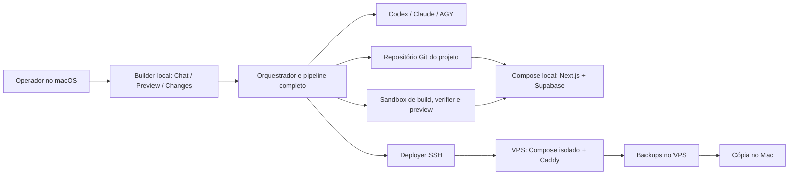
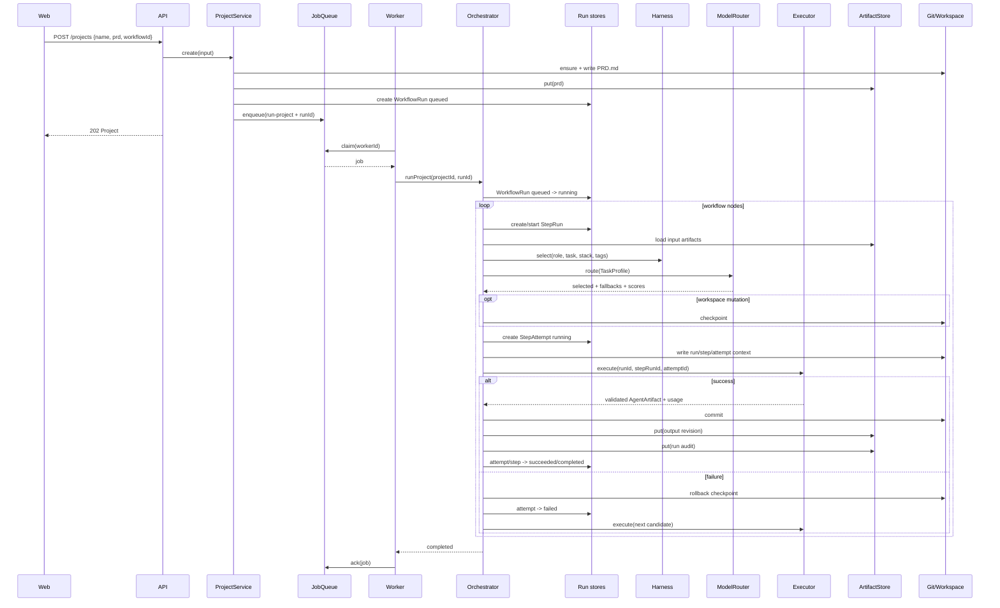

# Arquitetura

## Objetivo

O Agent Foundry separa seis preocupações que frequentemente aparecem misturadas em produtos de geração de software:

1. **Produto e transporte:** UI e API.
2. **Estado e entrega:** projeto, fila, eventos e artefatos.
3. **Workflow:** ordem, gates, reparos e limites.
4. **Inteligência:** harness, task profiling e model routing.
5. **Execução:** CLIs, workspace, Git e verificações determinísticas.
6. **Runtime do app:** Supabase local por projeto, preview e publicação Compose no VPS do operador.

A regra central é simples: **agentes não fazem handoff por memória implícita**. Eles leem artefatos persistidos e produzem novos artefatos validados.

## Componentes

### `apps/web`

Cliente Next.js. Cria projetos, consulta o runtime, acompanha eventos, abre artefatos e exibe as decisões do router. A timeline de eventos usa SSE (`GET /projects/:id/events/stream`) para atualização quase em tempo real, com o polling original mantido como fallback automático quando o stream cai ou antes de conectar.

### `apps/api`

Camada HTTP Fastify. Valida entradas com Zod e delega aos serviços de projeto e conversa. Não contém lógica de workflow nem lógica de fornecedor.

### `apps/worker`

Loop que reivindica jobs e chama `WorkflowOrchestrator.runProject`. Pode ser processo separado ou embutido na API para desenvolvimento.

### `packages/contracts`

Schemas e tipos compartilhados. Zod funciona como fronteira de confiança entre YAML, JSON persistido, CLIs e API.

### `packages/domain`

Portas para repositórios, fila, router, executores, verifier e workspace. Não importa Fastify, Next.js, YAML ou `execa`.

### `packages/persistence`

Implementações locais:

- projeto em JSON;
- conversa canônica por projeto, com mensagens, metadata de attachments e operações em JSON/JSONL;
- runs, steps e attempts versionados em uma hierarquia própria;
- eventos em JSONL;
- artefatos revisionados com SHA-256;
- fila por diretórios e rename atômico;
- métricas com lock de diretório;
- workspace e operações Git;
- workflows YAML;
- policies YAML versionadas (`policies/<id>.yaml`), com hash fixado por run.

### `packages/harness`

Lê `manifest.json`, aplica seleção por papel, tarefa, stack e tags, ordena por prioridade e produz um snapshot versionado.

### `packages/model-router`

Aplica hard constraints, calcula score, produz candidatos de fallback e usa métricas observadas. O router nunca executa a CLI.

### `packages/executors`

Traduz uma requisição uniforme para argumentos de cada CLI. Também inclui:

- parser tolerante de JSON estruturado;
- extração best-effort de usage;
- executor mock;
- registry;
- verifier do workspace.
- `PlaywrightBrowserVerifier`, implementação Chromium do port `BrowserVerifier`.

### `packages/orchestrator`

Coordena tudo. O motor:

- lê o workflow;
- carrega artefatos;
- seleciona harness;
- perfila a tarefa;
- pede uma rota;
- grava contexto de run;
- cria checkpoint Git;
- executa candidato e fallbacks;
- persiste `WorkflowRun`, `StepRun`, `StepAttempt`, artefato, audit record e decisões;
- coleta métricas;
- avalia quality loops;
- avança o estado do projeto.

`BrowserVerificationCoordinator` inicia uma sessão de preview, passa o plano e as origens permitidas
ao port, e sempre para a sessão. O orquestrador persiste o report como artifact normal e associa o
attempt ao `previewSessionId`; não conhece Playwright.

Desde a ADR 0023, o orquestrador submete trabalho de agente pela port `ExecutionPlane`
(`submit`/`cancel`/`status`) em vez de chamar `ExecutorRegistry` diretamente. `LocalExecutionPlane`
(em `packages/executors`) é a única implementação hoje: roda as CLIs no mesmo processo do control
plane, in-process, confiável apenas para desenvolvimento local — sem mudança de comportamento ou de
fronteira de confiança em relação ao `ExecutorRegistry` direto de antes. No diagrama de sequência
abaixo, o participante `E` (Executor) agora é alcançado através dessa port.

### `packages/composition`

Composition root. Converte ambiente em configuração e conecta implementações concretas às portas.

## Arquitetura-alvo do Personal Builder v1

O control plane continua local e loopback. Cada projeto greenfield ganha um repositório Git e um runtime Docker Compose isolados. O runtime do app não compartilha banco, auth, storage, rede ou volumes com outro projeto.



### Fronteiras novas

- `GeneratedProjectRuntime` controla o Compose local, migrations, seed e health.
- `PreviewRunner` e `BrowserVerifier` executam apenas através de `SandboxRunner`.
- `DeploymentProvider` v1 possui uma única implementação: SSH + Docker Compose em VPS existente.
- `BackupProvider` agenda backup no VPS, verifica integridade e copia para o Mac.
- `ProjectVersion` liga operação, commit, artefatos, preview e release.
- `.env` é entrada confiável do operador e nunca conteúdo de agente.

O rollback de release aponta para uma versão anterior do app e de sua configuração. Ele não reverte schema nem dados. Migrations destrutivas exigem approval e plano de forward fix.

## Fluxo detalhado



## Máquinas de estado de execução

```text
WorkflowRun: queued -> running -> completed | failed
                         |-> pause_requested -> paused -> running
                         |-> cancel_requested -> cancelled

StepRun: pending -> running -> completed | failed | cancelled
              |-> skipped | cancelled

StepAttempt: running -> succeeded | failed | cancelled
```

`WorkflowRun`, `StepRun` e `StepAttempt` são a fonte de verdade. `Project.currentRunId`, `status`, `currentNodeId` e `error` são somente um resumo derivado para compatibilidade da API e da UI. Cada entidade possui `version`; updates usam compare-and-swap e rejeitam uma versão esperada obsoleta.

No filesystem, o estado fica em `DATA_DIR/runs/<runId>/run.json`, com steps em `steps/<stepRunId>/step.json` e attempts em `steps/<stepRunId>/attempts/<attemptId>.json`. Contextos de executor usam a mesma identidade em `.orchestrator/runs/<runId>/steps/<stepRunId>/attempts/<attemptId>/`, evitando que attempts sobrescrevam requests anteriores.

## Execução de operações (Plan/Build)

Além do pipeline de projeto inteiro, o orquestrador suporta uma via de execução paralela e leve para operações de conversa com `kind` `'plan'` ou `'build'`. Cada operação é exatamente um `AgentStep` — sem grafo multi-nó, sem gates de approval entre nós — e nunca toca em `Project.status` ou `Project.currentRunId`. Ver [`docs/superpowers/specs/2026-07-18-plan-build-modes-design.md`](superpowers/specs/2026-07-18-plan-build-modes-design.md) para detalhes de design e rationale.

### `OperationService` e `ConversationOperationRunner`

`OperationService` (packages/orchestrator) aceita um início de operação de conversa, valida as constraint (uma `'build'` deve referenciar um plano aprovado OU ter `directExecution: true`), constrói um `TaskProfile` da operação, e enfileira um novo tipo de job `run-conversation-operation` carregando a identidade da execução.

`ConversationOperationRunner` (packages/orchestrator) consome esse job type na `WorkerLoop`, executando:

1. Roteador: `buildTaskProfile` → `scoreRouter` → seleciona modelo.
2. Compilação: `compileRequestMarkdown` + `compileCliPrompt` (mesmo contrato para `mutatesWorkspace`).
3. Execução: `ExecutorRegistry.get(provider).execute()` — mesmo request shape que execuções em nó de workflow.
4. Persistência: `ArtifactStore.put()` do resultado (artefato chamado `operation-{operationId}`), marca `StepRun`/`WorkflowRun` como completado.

### Gating do Build

Uma operação `'build'` só pode ser criada com exatamente uma das duas condições:

- `planOperationId`: referencia uma operação `'plan'` precedente com `approval.status === 'approved'`. A operação build herda `artifactReferences` do plano aprovado.
- `directExecution: true`: indica escolha explícita de pular o plano, registrada para auditoria.

Tentar criar um build sem nenhuma das duas, ou referenciar um plano não-aprovado, resulta em `400 ValidationError`.

## Conversa persistida por projeto

Cada projeto possui uma conversa canônica com `conversation.id === conversation.projectId === project.id`. Projetos anteriores derivam essa conversa de `project.id` e `project.createdAt` em leitura/export sem migração; o primeiro write da conversa cria `DATA_DIR/projects/<projectId>/conversation/conversation.json`.

Mensagens, metadata de attachments e operações ficam, respectivamente, em `messages.jsonl`, `attachments.jsonl` e `operations.jsonl` no mesmo diretório. Um lock de diretório serializa writes e idempotência; cada atualização publica o JSONL completo por temp file + rename atômico. Cada mensagem recebe um `sequence` positivo e contíguo; páginas HTTP e replay SSE usam esse número como cursor exclusivo. No stream, `?cursor=` tem precedência sobre `Last-Event-ID`; na ausência de ambos, o cursor é `0`. O export lê conversation e os três JSONLs sob esse mesmo lock, formando um único snapshot sem criar storage para projetos legados.

O aggregate contém apenas metadata de attachment, não o blob. `mediaType` aceita somente MIME bare `type/subtype`, sem parâmetros, e é normalizado para lowercase. Uma mensagem só referencia attachments do próprio projeto. Operações ligam a mensagem a referências tipadas e usam idempotency key por projeto: o mesmo input devolve o record original; input diferente responde `409`.

Redaction acontece antes de persistir texto/data de mensagem e nome de attachment. O export schema v1 e o SSE leem esses mesmos records redigidos. Blobs e UI permanecem em #43; classificação da conversa em operação fica em #38; execução/lifecycle da operação fica em #39.

## Artefatos como protocolo de handoff

O formato comum de saída é:

```json
{
  "schemaVersion": "1",
  "status": "completed",
  "summary": "Resumo verificável",
  "approved": true,
  "data": {},
  "decisions": [],
  "assumptions": [],
  "risks": [],
  "nextActions": []
}
```

O campo `data` é flexível; o envelope não é. Isso permite que o orquestrador trate saídas de papéis diferentes de forma uniforme sem apagar o conteúdo específico.

Cada revisão é imutável. Uma reparação grava `plan.current` revisão 2 em vez de sobrescrever revisão 1.

## Quality loop

Um `quality-loop` possui:

- `setup` opcional, que cria o artefato inicial;
- `check`, geralmente um reviewer ou verifier;
- `repair`, acionado quando a condição falha;
- `approval`, com artefato, caminho e valor esperado;
- `maxIterations`, para impedir loops infinitos.

A aprovação do reviewer também vira feedback de qualidade para o modelo que produziu o artefato revisado. Isso é melhor que medir apenas exit code, porque uma CLI pode terminar com sucesso e entregar lixo impecavelmente formatado.

O loop `browser-verification` é uma variante declarativa: `setup` produz `browser-test.plan`; o
`check` `verify-browser` referencia esse artifact e não pode misturar scripts de workspace nem
`git diff --check`; `repair-browser` recebe o report falho e a referência pinada ao plano. A referência
inicial (`name`, `revision`, `sha256`) é preservada entre iterações, então falha -> reparo -> rerun
executa a mesma jornada. O report version-1 contém `approved`, resumo, referência do plano, sessão de
preview sanitizada e steps com observações (`console-error`, `request-failed`, `http-error`,
`uncaught-exception`, `policy-block`).

O plano version-1 é um envelope `AgentArtifact` com viewport e até 100 steps. Cada step usa somente
`goto`, `click` ou `fill` e assertions `visible`, `hidden`, `containsText` ou `url`; o primeiro é
`goto`. O schema enviado ao provider expressa os invariantes compatíveis com JSON Schema e declara
IDs únicos em uma extensão de validação runtime, pois o padrão não suporta unicidade por propriedade.
O parser Zod continua autoritativo. Não há JavaScript arbitrário no contrato; a única instrumentação
no browser é estática e pertence ao executor para drenar timers one-shot limitados.

## Atomicidade e concorrência

- Escritas usam arquivo temporário + rename.
- Índices de artefatos e métricas usam lock de diretório.
- Projetos, runs, steps e attempts usam lock por entidade e controle otimista de versão.
- A fila reivindica jobs por rename de `pending` para `processing`.
- Git fornece checkpoint e rollback para tentativas mutáveis.

Isso é suficiente para um MVP em um único filesystem. Não oferece consenso distribuído, fencing token nem recuperação robusta de worker morto.

## Fronteiras de confiança

Entradas não confiáveis incluem:

- PRD do usuário;
- YAML editado;
- saída de CLI;
- arquivos criados por agentes;
- scripts do projeto gerado.

Zod valida estrutura, não intenção. Git reverte arquivos, não impede exfiltração. O verifier detecta falhas, não torna código hostil seguro. A fronteira de execução precisa de isolamento operacional real.

## Decisões arquiteturais principais

### Arquivos antes de banco

Para a primeira versão, arquivos tornam o estado visível, copiável e fácil de depurar. A troca futura por Postgres deve acontecer atrás das portas do domínio.

### Workflow declarativo

Regras de sequência pertencem ao YAML; sem isso, cada novo produto exigiria editar e redeployar o motor.

### Router separado do orquestrador

O orquestrador pergunta “quem deve executar?”, mas não conhece fornecedores. Isso permite mudar política, catálogo ou benchmark sem reescrever o workflow.

### CLI adapters separados

Cada fornecedor tem flags, permissões e formatos próprios. Fingir que são iguais só empurra diferenças para condicionais espalhadas.

### Git para tentativas mutáveis

Fallback sem rollback permite que o segundo modelo trabalhe sobre um workspace parcialmente corrompido pelo primeiro. O checkpoint elimina essa ambiguidade.

## Pontos de extensão

- Implementar novas portas de persistência.
- Adicionar novos tipos de nó ao workflow.
- Criar seleção semântica de harness.
- Adicionar executor por API além de CLI.
- Incluir benchmark e exploração controlada no router.
- Separar verifier em sandbox dedicado.
