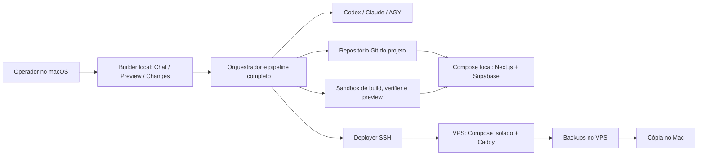
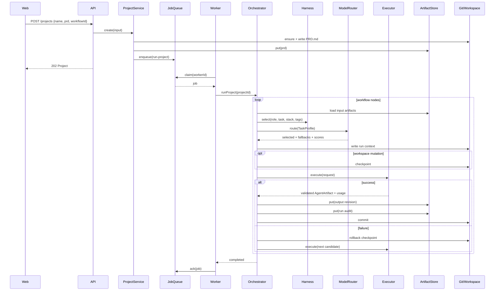

# Arquitetura

## Objetivo

O Agent Foundry separa seis preocupações que frequentemente aparecem misturadas em produtos de geração de software:

1. **Produto e transporte:** UI e API.
2. **Estado e entrega:** projeto, fila, eventos e artefatos.
3. **Workflow:** ordem, gates, reparos e limites.
4. **Inteligência:** harness, task profiling e model routing.
5. **Execução:** CLIs, workspace, Git e verificações determinísticas.
6. **Runtime do app:** Supabase local por projeto, preview e publicação Compose no VPS do operador.

A regra central é simples: **agentes não fazem handoff por memória implícita**. Eles leem artefatos persistidos e produzem novos artefatos validados.

## Componentes

### `apps/web`

Cliente Next.js. Cria projetos, consulta o runtime, acompanha eventos, abre artefatos e exibe as decisões do router. O polling é intencionalmente simples para o MVP.

### `apps/api`

Camada HTTP Fastify. Valida entradas com Zod e delega ao `ProjectService`. Não contém lógica de workflow nem lógica de fornecedor.

### `apps/worker`

Loop que reivindica jobs e chama `WorkflowOrchestrator.runProject`. Pode ser processo separado ou embutido na API para desenvolvimento.

### `packages/contracts`

Schemas e tipos compartilhados. Zod funciona como fronteira de confiança entre YAML, JSON persistido, CLIs e API.

### `packages/domain`

Portas para repositórios, fila, router, executores, verifier e workspace. Não importa Fastify, Next.js, YAML ou `execa`.

### `packages/persistence`

Implementações locais:

- projeto em JSON;
- eventos em JSONL;
- artefatos revisionados com SHA-256;
- fila por diretórios e rename atômico;
- métricas com lock de diretório;
- workspace e operações Git;
- workflows YAML.

### `packages/harness`

Lê `manifest.json`, aplica seleção por papel, tarefa, stack e tags, ordena por prioridade e produz um snapshot versionado.

### `packages/model-router`

Aplica hard constraints, calcula score, produz candidatos de fallback e usa métricas observadas. O router nunca executa a CLI.

### `packages/executors`

Traduz uma requisição uniforme para argumentos de cada CLI. Também inclui:

- parser tolerante de JSON estruturado;
- extração best-effort de usage;
- executor mock;
- registry;
- verifier do workspace.

### `packages/orchestrator`

Coordena tudo. O motor:

- lê o workflow;
- carrega artefatos;
- seleciona harness;
- perfila a tarefa;
- pede uma rota;
- grava contexto de run;
- cria checkpoint Git;
- executa candidato e fallbacks;
- persiste artefato, run record e decisões;
- coleta métricas;
- avalia quality loops;
- avança o estado do projeto.

### `packages/composition`

Composition root. Converte ambiente em configuração e conecta implementações concretas às portas.

## Arquitetura-alvo do Personal Builder v1

O control plane continua local e loopback. Cada projeto greenfield ganha um repositório Git e um runtime Docker Compose isolados. O runtime do app não compartilha banco, auth, storage, rede ou volumes com outro projeto.



### Fronteiras novas

- `GeneratedProjectRuntime` controla o Compose local, migrations, seed e health.
- `PreviewRunner` e `BrowserVerifier` executam apenas através de `SandboxRunner`.
- `DeploymentProvider` v1 possui uma única implementação: SSH + Docker Compose em VPS existente.
- `BackupProvider` agenda backup no VPS, verifica integridade e copia para o Mac.
- `ProjectVersion` liga operação, commit, artefatos, preview e release.
- `.env` é entrada confiável do operador e nunca conteúdo de agente.

O rollback de release aponta para uma versão anterior do app e de sua configuração. Ele não reverte schema nem dados. Migrations destrutivas exigem approval e plano de forward fix.

## Fluxo detalhado



## Máquina de estados do projeto

```text
queued -> running -> completed
                  -> failed -> queued (retry)
```

O campo `currentNodeId` indica o nó atual. Eventos detalhados registram transições menores, mas não são usados como única fonte de estado.

## Artefatos como protocolo de handoff

O formato comum de saída é:

```json
{
  "schemaVersion": "1",
  "status": "completed",
  "summary": "Resumo verificável",
  "approved": true,
  "data": {},
  "decisions": [],
  "assumptions": [],
  "risks": [],
  "nextActions": []
}
```

O campo `data` é flexível; o envelope não é. Isso permite que o orquestrador trate saídas de papéis diferentes de forma uniforme sem apagar o conteúdo específico.

Cada revisão é imutável. Uma reparação grava `plan.current` revisão 2 em vez de sobrescrever revisão 1.

## Quality loop

Um `quality-loop` possui:

- `setup` opcional, que cria o artefato inicial;
- `check`, geralmente um reviewer ou verifier;
- `repair`, acionado quando a condição falha;
- `approval`, com artefato, caminho e valor esperado;
- `maxIterations`, para impedir loops infinitos.

A aprovação do reviewer também vira feedback de qualidade para o modelo que produziu o artefato revisado. Isso é melhor que medir apenas exit code, porque uma CLI pode terminar com sucesso e entregar lixo impecavelmente formatado.

## Atomicidade e concorrência

- Escritas usam arquivo temporário + rename.
- Índices de artefatos e métricas usam lock de diretório.
- A fila reivindica jobs por rename de `pending` para `processing`.
- Git fornece checkpoint e rollback para tentativas mutáveis.

Isso é suficiente para um MVP em um único filesystem. Não oferece consenso distribuído, fencing token nem recuperação robusta de worker morto.

## Fronteiras de confiança

Entradas não confiáveis incluem:

- PRD do usuário;
- YAML editado;
- saída de CLI;
- arquivos criados por agentes;
- scripts do projeto gerado.

Zod valida estrutura, não intenção. Git reverte arquivos, não impede exfiltração. O verifier detecta falhas, não torna código hostil seguro. A fronteira de execução precisa de isolamento operacional real.

## Decisões arquiteturais principais

### Arquivos antes de banco

Para a primeira versão, arquivos tornam o estado visível, copiável e fácil de depurar. A troca futura por Postgres deve acontecer atrás das portas do domínio.

### Workflow declarativo

Regras de sequência pertencem ao YAML; sem isso, cada novo produto exigiria editar e redeployar o motor.

### Router separado do orquestrador

O orquestrador pergunta “quem deve executar?”, mas não conhece fornecedores. Isso permite mudar política, catálogo ou benchmark sem reescrever o workflow.

### CLI adapters separados

Cada fornecedor tem flags, permissões e formatos próprios. Fingir que são iguais só empurra diferenças para condicionais espalhadas.

### Git para tentativas mutáveis

Fallback sem rollback permite que o segundo modelo trabalhe sobre um workspace parcialmente corrompido pelo primeiro. O checkpoint elimina essa ambiguidade.

## Pontos de extensão

- Implementar novas portas de persistência.
- Adicionar novos tipos de nó ao workflow.
- Criar seleção semântica de harness.
- Adicionar executor por API além de CLI.
- Incluir benchmark e exploração controlada no router.
- Emitir eventos por SSE.
- Separar verifier em sandbox dedicado.
