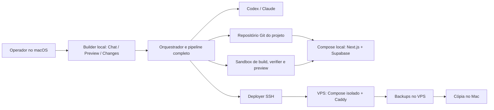
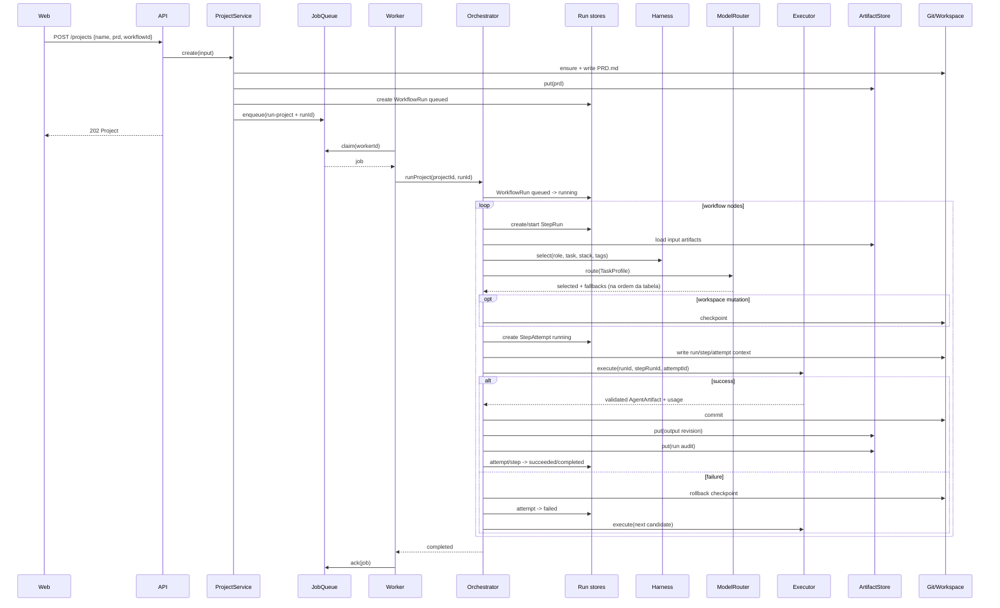

# Arquitetura

## Objetivo

O Agent Foundry separa seis preocupações que frequentemente aparecem misturadas em produtos de geração de software:

1. **Produto e transporte:** UI e API.
2. **Estado e entrega:** projeto, fila, eventos e artefatos.
3. **Workflow:** ordem, gates, reparos e limites.
4. **Inteligência:** harness, task profiling e model routing.
5. **Execução:** CLIs, workspace, Git e verificações determinísticas.
6. **Runtime do app:** Supabase local por projeto, preview e publicação Compose no VPS do operador.

A regra central é simples: **agentes não fazem handoff por memória implícita**. Eles leem artefatos persistidos e produzem novos artefatos validados.

## Componentes

### `apps/web`

Cliente Next.js. Cria projetos, consulta o runtime, acompanha eventos, abre artefatos e exibe as decisões do router. A timeline de eventos usa SSE (`GET /projects/:id/events/stream`) para atualização quase em tempo real, com o polling original mantido como fallback automático quando o stream cai ou antes de conectar.

### `apps/api`

Camada HTTP Fastify. Valida entradas com Zod e delega aos serviços de projeto e conversa. Não contém lógica de workflow nem lógica de fornecedor.

### `apps/worker`

Loop que reivindica jobs e chama `WorkflowOrchestrator.runProject`. Pode ser processo separado ou embutido na API para desenvolvimento.

### `packages/contracts`

Schemas e tipos compartilhados. Zod funciona como fronteira de confiança entre YAML, JSON persistido, CLIs e API.

### `packages/domain`

Portas para repositórios, fila, router, executores, verifier e workspace. Não importa Fastify, Next.js, YAML ou `execa`.

### `packages/persistence`

Implementações locais:

- projeto em JSON;
- conversa canônica por projeto, com mensagens, metadata de attachments e operações em JSON/JSONL;
- runs, steps e attempts versionados em uma hierarquia própria;
- eventos em JSONL;
- artefatos revisionados com SHA-256;
- fila por diretórios e rename atômico;
- métricas com lock de diretório;
- workspace e operações Git;
- workflows YAML;
- policies YAML versionadas (`policies/<id>.yaml`), com hash fixado por run.

### `packages/harness`

Lê `manifest.json`, aplica seleção por papel, tarefa, stack e tags, ordena por prioridade e produz um snapshot versionado.

### `packages/model-router`

Aplica hard constraints (policy, allowlist de provider, escrita no workspace, contexto, circuit breaker) e depois ordena os elegíveis pela **tabela de executores** do workflow — task kind → lista ordenada, cabeça primeiro (ADR 0046). Nenhum score é calculado: a tabela escolhe o executor e a ordem do catálogo escolhe o modelo dele. O router nunca executa a CLI.

### `packages/executors`

Traduz uma requisição uniforme para argumentos de cada CLI. Também inclui:

- parser tolerante de JSON estruturado;
- extração best-effort de usage;
- executor mock;
- registry;
- verifier do workspace.
- `PlaywrightBrowserVerifier`, implementação Chromium do port `BrowserVerifier`.

### `packages/orchestrator`

Coordena tudo. O motor:

- lê o workflow;
- carrega artefatos;
- seleciona harness;
- perfila a tarefa;
- pede uma rota;
- grava contexto de run;
- cria checkpoint Git;
- executa candidato e fallbacks;
- persiste `WorkflowRun`, `StepRun`, `StepAttempt`, artefato, audit record e decisões;
- coleta métricas;
- avalia quality loops;
- avança o estado do projeto.

`BrowserVerificationCoordinator` inicia uma sessão de preview, passa o plano e as origens permitidas
ao port, e sempre para a sessão. O orquestrador persiste o report e screenshots/trace/video como
artifacts, e associa o attempt ao `previewSessionId`; não conhece Playwright.

Desde a ADR 0023, o orquestrador submete trabalho de agente pela port `ExecutionPlane`
(`submit`/`cancel`/`status`) em vez de chamar `ExecutorRegistry` diretamente. `LocalExecutionPlane`
(em `packages/executors`) roda as CLIs no mesmo processo do control plane e continua ativo até o
secret broker remover a dependência de credenciais persistentes do host. `SandboxRunner` possui a
implementação real `DockerSandboxRunner` (ADRs 0025 e 0057): rootless, com recursos limitados, na
rede padrão do Docker — o código executado é do próprio dono (ADR 0057). O runtime real usa esse
backend para instalação de dependências de preview; Chromium de verificação fica confinado ao
preview + `allowedOrigins` via `context.route()`. No
diagrama de sequência abaixo, o participante `E` (Executor) é alcançado através da port
`ExecutionPlane`.

### `packages/composition`

Composition root. Converte ambiente em configuração e conecta implementações concretas às portas.

## Arquitetura-alvo do Personal Builder v1

O control plane continua local e loopback. Cada projeto greenfield ganha um repositório Git e um runtime Docker Compose isolados. O runtime do app não compartilha banco, auth, storage, rede ou volumes com outro projeto.


```mermaid
flowchart LR
  U["Operador no macOS"] --> B["Builder local: Chat / Preview / Changes"]
  B --> O["Orquestrador e pipeline completo"]
  O --> C["Codex / Claude"]
  O --> G["Repositório Git do projeto"]
  O --> S["Sandbox de build, verifier e preview"]
  G --> L["Compose local: Next.js + Supabase"]
  S --> L
  O --> D["Deployer SSH"]
  D --> V["VPS: Compose isolado + Caddy"]
  V --> K["Backups no VPS"]
  K --> M["Cópia no Mac"]
```

### Fronteiras novas

- `GeneratedProjectRuntime` controla o Compose local, migrations, seed e health.
- `PreviewRunner` e `BrowserVerifier` executam apenas através de `SandboxRunner`.
- `DeploymentProvider` v1 possui uma única implementação: SSH + Docker Compose em VPS existente.
- `BackupProvider` agenda backup no VPS, verifica integridade e copia para o Mac.
- `ProjectVersion` liga operação, commit, artefatos, preview e release.
- `.env` é entrada confiável do operador e nunca conteúdo de agente.

O rollback de release aponta para uma versão anterior do app e de sua configuração. Ele não reverte schema nem dados. Migrations destrutivas exigem approval e plano de forward fix.

## Fluxo detalhado


```mermaid
sequenceDiagram
    participant UI as Web
    participant API as API
    participant PS as ProjectService
    participant Q as JobQueue
    participant W as Worker
    participant O as Orchestrator
    participant S as Run stores
    participant H as Harness
    participant R as ModelRouter
    participant E as Executor
    participant A as ArtifactStore
    participant G as Git/Workspace

    UI->>API: POST /projects {name, prd, workflowId}
    API->>PS: create(input)
    PS->>G: ensure + write PRD.md
    PS->>A: put(prd)
    PS->>S: create WorkflowRun queued
    PS->>Q: enqueue(run-project + runId)
    API-->>UI: 202 Project

    W->>Q: claim(workerId)
    Q-->>W: job
    W->>O: runProject(projectId, runId)
    O->>S: WorkflowRun queued -> running

    loop workflow nodes
      O->>S: create/start StepRun
      O->>A: load input artifacts
      O->>H: select(role, task, stack, tags)
      O->>R: route(TaskProfile)
      R-->>O: selected + fallbacks (na ordem da tabela)
      opt workspace mutation
        O->>G: checkpoint
      end
      O->>S: create StepAttempt running
      O->>G: write run/step/attempt context
      O->>E: execute(runId, stepRunId, attemptId)
      alt success
        E-->>O: validated AgentArtifact + usage
        O->>G: commit
        O->>A: put(output revision)
        O->>A: put(run audit)
        O->>S: attempt/step -> succeeded/completed
      else failure
        O->>G: rollback checkpoint
        O->>S: attempt -> failed
        O->>E: execute(next candidate)
      end
    end

    O-->>W: completed
    W->>Q: ack(job)
```

## Máquinas de estado de execução

```text
WorkflowRun: queued -> running -> completed | failed
                         |-> pause_requested -> paused -> running
                         |-> cancel_requested -> cancelled

StepRun: pending -> running -> completed | failed | cancelled
              |-> skipped | cancelled

StepAttempt: running -> succeeded | failed | cancelled
```

`WorkflowRun`, `StepRun` e `StepAttempt` são a fonte de verdade. `Project.currentRunId`, `status`, `currentNodeId` e `error` são somente um resumo derivado para compatibilidade da API e da UI. Cada entidade possui `version`; updates usam compare-and-swap e rejeitam uma versão esperada obsoleta.

No filesystem, o estado fica em `DATA_DIR/runs/<runId>/run.json`, com steps em `steps/<stepRunId>/step.json` e attempts em `steps/<stepRunId>/attempts/<attemptId>.json`. Contextos de executor usam a mesma identidade em `.orchestrator/runs/<runId>/steps/<stepRunId>/attempts/<attemptId>/`, evitando que attempts sobrescrevam requests anteriores.

## Execução de operações (Plan/Build)

Além do pipeline de projeto inteiro, o orquestrador suporta uma via de execução paralela e leve para operações de conversa com `kind` `'plan'` ou `'build'`. Cada operação é exatamente um `AgentStep` — sem grafo multi-nó, sem gates de approval entre nós — e nunca toca em `Project.status` ou `Project.currentRunId`. Ver [`docs/superpowers/specs/2026-07-18-plan-build-modes-design.md`](superpowers/specs/2026-07-18-plan-build-modes-design.md) para detalhes de design e rationale.

### `OperationService` e `ConversationOperationRunner`

`OperationService` (packages/orchestrator) aceita um início de operação de conversa, valida as constraint (uma `'build'` deve referenciar um plano aprovado OU ter `directExecution: true`), constrói um `TaskProfile` da operação, e enfileira um novo tipo de job `run-conversation-operation` carregando a identidade da execução.

`ConversationOperationRunner` (packages/orchestrator) consome esse job type na `WorkerLoop`, executando:

1. Roteador: `buildTaskProfile` → `TableModelRouter` → seleciona o executor da cabeça da tabela.
2. Compilação: `compileRequestMarkdown` + `compileCliPrompt` (mesmo contrato para `mutatesWorkspace`).
3. Execução: `ExecutorRegistry.get(provider).execute()` — mesmo request shape que execuções em nó de workflow.
4. Persistência: `ArtifactStore.put()` do resultado (artefato chamado `operation-{operationId}`), marca `StepRun`/`WorkflowRun` como completado.

### Gating do Build

Uma operação `'build'` só pode ser criada com exatamente uma das duas condições:

- `planOperationId`: referencia uma operação `'plan'` precedente com `approval.status === 'approved'`. A operação build herda `artifactReferences` do plano aprovado.
- `directExecution: true`: indica escolha explícita de pular o plano, registrada para auditoria.

Tentar criar um build sem nenhuma das duas, ou referenciar um plano não-aprovado, resulta em `400 ValidationError`.

### Classificação de mensagem e compilação de contexto

`OperationService.classify()` (packages/orchestrator) roda uma classificação determinística e pura
sobre o texto da mensagem (`message-classifier.ts` — sem chamada a modelo, sem I/O) e persiste um
`ChangeRequest` com `status: 'proposed'`, o `OperationKind` sugerido, uma justificativa, e
`referencedDecisionIds` — outros `ChangeRequest`s `confirmed` cujo resumo compartilha duas ou mais
palavras significativas com a mensagem atual. `classify()` é idempotente por mensagem.

`OperationService.decideChangeRequest()` é o único caminho que transforma uma classificação em
`Operation`: `'reject'` marca o change request como `rejected` sem criar nada; `'confirm'` aceita um
`kind` que pode divergir da sugestão — essa divergência é a correção do usuário — e só então cria a
`Operation`, via `start()` para `plan`/`build` ou via `ConversationService.createOperation()` para os
demais kinds. `Build` nunca é criado automaticamente a partir de `classify()`.

`ConversationOperationRunner` compila um digest limitado (`context-compiler.ts`, também
determinístico) a partir do `ChangeRequest` da operação: decisões `confirmed` referenciadas ou
recentes ficam detalhadas ("Pinned decisions"), `ChangeRequest`s `proposed` ficam sempre detalhados
("Unresolved feedback"), `ProjectVersion`s recentes aparecem com seu id, e todo o resto vira uma
linha compacta com id + resumo — nunca desaparece da lista de `sources`, só perde detalhe. Após
`harness.select()`, os caminhos dos fragmentos de harness selecionados (as "knowledge files" do
prompt — não existe ainda um repositório de arquivos de conhecimento enviados pelo usuário; ver
`v06-knowledge-attachments-shell`) são adicionados a `sources` e persistidos de volta no
`ChangeRequest`, independente do sucesso da execução do agente.

## Conversa persistida por projeto

Cada projeto possui uma conversa canônica com `conversation.id === conversation.projectId === project.id`. Projetos anteriores derivam essa conversa de `project.id` e `project.createdAt` em leitura/export sem migração; o primeiro write da conversa cria `DATA_DIR/projects/<projectId>/conversation/conversation.json`.

Mensagens, metadata de attachments e operações ficam, respectivamente, em `messages.jsonl`, `attachments.jsonl` e `operations.jsonl` no mesmo diretório. Um lock de diretório serializa writes e idempotência; cada atualização publica o JSONL completo por temp file + rename atômico. Cada mensagem recebe um `sequence` positivo e contíguo; páginas HTTP e replay SSE usam esse número como cursor exclusivo. No stream, `?cursor=` tem precedência sobre `Last-Event-ID`; na ausência de ambos, o cursor é `0`. O export lê conversation e os três JSONLs sob esse mesmo lock, formando um único snapshot sem criar storage para projetos legados.

O aggregate contém apenas metadata de attachment, não o blob. `mediaType` aceita somente MIME bare `type/subtype`, sem parâmetros, e é normalizado para lowercase. Uma mensagem só referencia attachments do próprio projeto. Operações ligam a mensagem a referências tipadas e usam idempotency key por projeto: o mesmo input devolve o record original; input diferente responde `409`.

Redaction acontece antes de persistir texto/data de mensagem e nome de attachment. O export schema v1 e o SSE leem esses mesmos records redigidos. Blobs e UI permanecem em #43; classificação da conversa em operação fica em #38; execução/lifecycle da operação fica em #39.

## Artefatos como protocolo de handoff

O formato comum de saída é:

```json
{
  "schemaVersion": "1",
  "status": "completed",
  "summary": "Resumo verificável",
  "approved": true,
  "data": {},
  "decisions": [],
  "assumptions": [],
  "risks": [],
  "nextActions": []
}
```

O campo `data` é flexível; o envelope não é. Isso permite que o orquestrador trate saídas de papéis diferentes de forma uniforme sem apagar o conteúdo específico.

Cada revisão é imutável. Uma reparação grava `plan.current` revisão 2 em vez de sobrescrever revisão 1.

Passos de agente podem declarar `outputContract: task-graph` (ADR 0039). Nesse caso o `data` do
artefato deve conter um grafo de tarefas validado (`TaskGraphSchema` em `packages/contracts`): cada
tarefa carrega id estável, título, dependências, entregáveis e um critério de aceite. IDs únicos,
dependências existentes e aciclicidade são impostos pelo parser Zod autoritativo no orquestrador — uma
saída fora do contrato falha o attempt em vez de virar revisão de `plan.current`; o provider recebe o
espelho JSON Schema com o marcador de validação runtime, como no plano de teste de browser. O passo
`plan` de `web-app-v1` declara o contrato; `dogfood-plan-v1` fica de fora por produzir artefatos de
análise arbitrários.

## Gate de plano

`web-app-v1` chega ao plano com **uma** chamada de modelo: o nó `plan` grava `plan.current` e o nó
`plan-approval` (`approval-gate`, `actions: [approve, reject]`, `onReject: end`) para a execução até o
operador decidir. Nenhum modelo avalia a prosa de outro modelo como gate bloqueante — ADR 0042 removeu
`review-plan`, `repair-plan` e o `architecture-gate` inteiro, com os artefatos `plan.review`,
`architecture.current` e `architecture.review`. Rejeitar encerra o run como `rejected` e grava a
justificativa do operador no evento `run.rejected` e na `ApprovalDecision` imutável.

Os papéis `architect` e `architecture-reviewer` e as tarefas `architecture` e `architecture-review`
não existem mais no contrato. `plan-reviewer` sobrevive apenas para `dogfood-plan-v1`, que é o harness
de benchmark que pontua capacidade de revisão.

## Execução por tarefa (`for-each-task`)

Depois da aprovação do plano, `web-app-v1` executa o grafo de tarefas em vez de construir a aplicação
inteira num nó só. O nó `task-execution` (`for-each-task`, ADR 0043) declara `taskGraphArtifact`
(`plan.current`), um passo `implement` com `mutatesWorkspace: true` e o par `verify`/`repair` que
forma o gate determinístico da tarefa (ADR 0045).

- A caminhada é sequencial e respeita as arestas: a próxima tarefa é a primeira, na ordem declarada,
  cujos bloqueadores já concluíram (`nextReadyTask`, em `packages/domain`). Ordem de declaração não é
  ordem de execução.
- Cada tarefa roda sob o id derivado `<implement>.<taskId>`, com título, entregáveis, critério de
  aceite e dependências anexados às instruções. Isso dá a cada tarefa seu próprio `StepRun`, pasta de
  request, eventos e commit (`agent(developer): <taskId>: <título>`).
- `implement.maxAttempts` **é honrado** para a escada de qualidade: depois de um relatório vermelho
  real e do reparo esgotado, cada tentativa usa o próximo executor da tabela, com `StepRun` e
  `iteration` próprios. Falhas do provider/CLI consomem os fallbacks do próprio step e não iniciam
  uma escada especulativa.
- Cada avanço emite `task.failed` com `attempt`, `maxAttempts`, `executor` e
  `attemptedExecutors`; `agent.routed` registra a tabela e `selectedIndex`. Se a lista de executores
  terminar, a tarefa falha sem uma rota vazia e o checkpoint da tarefa é restaurado (#327).
- Uma tentativa falha volta apenas ao checkpoint daquela tentativa: as tarefas já commitadas
  sobrevivem. Falhar interrompe a caminhada, então dependentes da tarefa falha não rodam.
- A revisão do grafo lida no início é pinada nas entradas de cada tarefa, então um replay depois de
  pausa reaproveita as tarefas concluídas e retoma na primeira incompleta.
- Eventos `task.started` / `task.completed` / `task.failed` carregam `taskId`, `stepId`, `attempt` e o
  commit, que é o que torna um grafo de 20 tarefas legível na timeline.

### Gate determinístico por tarefa (ADR 0045)

Depois da implementação e **antes** de a tarefa concluir, `verify` roda os comandos que podem
realmente falhar no workspace do projeto. Nenhum modelo julga o trabalho de outro modelo.

- `autofixScripts` (`format`, `lint:fix`) rodam primeiro e nunca reprovam — ficam no relatório como
  `advisory: true`. O que uma máquina conserta sozinha jamais chega ao agente.
- `scripts` continua estrito (`typecheck`): script exigido e ausente é relatório vermelho.
  `optionalScripts` (`lint`, `test`, `db:start`, `db:reset`, `smoke`) só rodam quando o projeto os
  define, nessa ordem; quando não define, entram como `skipped` com motivo. `db:start` sobe o stack
  Supabase do próprio workspace e escreve o `.env`, `db:reset` reaplica todas as migrations e o seed
  nele, e `smoke` prova que os dois tiers sobem e respondem.
- Relatório vermelho — e só ele — dispara `repair`, com a revisão exata de `verification.report`
  pinada nas entradas: comando, exit status e stdout/stderr capturados.
- `repair.maxAttempts` limita o laço. Esgotar falha a tarefa com
  `Task <id> failed verification after N repair attempt(s)`, sem re-executar a implementação.
- A tarefa faz checkpoint antes da primeira tentativa e volta a ele ao falhar: uma tarefa que nunca
  fica verde não deixa commit, e as tarefas commitadas antes dela sobrevivem. Erros de controle de
  fluxo (pausa, cancelamento) preservam o trabalho.
- Uma tarefa reparada termina em **dois** commits — `agent(developer): <taskId>: <título>` e
  `agent(fixer): <taskId>: repair <título>`. `task.completed.commit` reporta o último, que é a árvore
  que passou nos checks.
- `task.completed` só é emitido depois de um relatório verde; `quality.approved` e
  `quality.repair_requested` carregam `taskId`.

### Canais de aceitação por tarefa (ADR 0047, #393)

Passar no typecheck não significa que uma superfície visível funciona. O contrato do plano declara
`acceptanceMode` para tornar o canal explícito: `deterministic-only` executa apenas os checks
determinísticos, enquanto `browser-visible` também transforma o `acceptanceCheck` da tarefa em uma
asserção contra o preview vivo. Grafos históricos sem o campo continuam legíveis e preservam o
comportamento legado.

- `browser.plan` transforma o `acceptanceCheck` num `browser-test.plan` declarativo; `browser.check`
  é o runner Playwright que já existia, movido para dentro do laço em vez de reimplementado.
- `browser-visible` exige o gate determinístico: um preview de código que não compila não prova nada.
- Asserção reprovada dispara `repair` com o plano **e** o relatório pinados: passo que falhou, erro e
  referências de screenshot/trace. O plano vai pinado sem alteração para a reexecução.
- O reparo da asserção é um passo próprio, `<repair>-browser.<taskId>` — os dois laços rodam para a
  mesma tarefa e colidiriam na identidade do passo, e a timeline separa "os checks estavam vermelhos"
  de "a funcionalidade não funcionou".
- Tarefa sem superfície visível responde `status: blocked` no passo de plano, emite
  `quality.approved` com `asserted: false` e conclui normalmente. É uma resposta, não uma falha.
- Negação cross-tenant não precisa de máquina nova: a tarefa cujo acceptance check cita dados de
  outro usuário ganha um plano que entra com uma conta e afirma que as linhas da outra não aparecem,
  contra RLS real.

### Cauda do pipeline (#329)

Depois de `task-execution`, `web-app-v1` executa uma única verificação completa no workspace:
`full-suite-verification` roda `typecheck`, `lint`, `test`, `build` e `git diff --check`. `VerifyStep`
continua advisory por padrão, mas `blocksOnFailure: true` torna esse relatório bloqueante: o relatório
vermelho é persistido e o `StepRun` falha, impedindo qualquer aprovação de diff.

Se a suíte passar, `release-assessment` roda uma vez como agente advisory, com `mutatesWorkspace: false`.
Ele registra o `AgentArtifact` `release.review` — resumo, status, riscos, decisões e próximas ações —
sem transformar seu campo `approved` em gate. Por fim, `diff-approval` é o gate humano final e consome
esse artefato. Assim a cauda é `task-execution → full-suite-verification → release-assessment →
diff-approval`; os nós standalone `deterministic-verification`, `browser-verification` e
`repair-release` não pertencem mais a `web-app-v1`.

## Quality loop

Um `quality-loop` possui:

- `setup` opcional, que cria o artefato inicial;
- `check`, geralmente um reviewer ou verifier;
- `repair`, acionado quando a condição falha;
- `approval`, com artefato, caminho e valor esperado.

`maxIterations` não faz parte do contrato atual: o engine não o usa para limitar loops e o schema
não o anuncia. Workflows legados ainda podem ser lidos, mas o limite de segurança continua sendo o
emergency ceiling do run.

A aprovação do reviewer também vira feedback de qualidade para o modelo que produziu o artefato revisado. Isso é melhor que medir apenas exit code, porque uma CLI pode terminar com sucesso e entregar lixo impecavelmente formatado.

Um loop declarativo de `browser-verification` ainda é suportado por workflows que o declararem:
`setup` produz `browser-test.plan`; o
`check` `verify-browser` referencia esse artifact e não pode misturar scripts de workspace nem
`git diff --check`; `repair-browser` recebe o report falho e a referência pinada ao plano. A referência
inicial (`name`, `revision`, `sha256`) é preservada entre iterações, então falha -> reparo -> rerun
executa a mesma jornada. O report version-1 contém `approved`, resumo, referência do plano, sessão de
preview sanitizada e steps com observações (`console-error`, `request-failed`, `http-error`,
`uncaught-exception`, `policy-block`).

O plano version-1 é um envelope `AgentArtifact` com viewport e até 100 steps. Cada step usa somente
`goto`, `click` ou `fill` e assertions `visible`, `hidden`, `containsText` ou `url`; o primeiro é
`goto`. O schema enviado ao provider expressa os invariantes compatíveis com JSON Schema e declara
IDs únicos em uma extensão de validação runtime, pois o padrão não suporta unicidade por propriedade.
O parser Zod continua autoritativo. Não há JavaScript arbitrário no contrato; a única instrumentação
no browser é estática e pertence ao executor para drenar timers one-shot limitados.

## Atomicidade e concorrência

- Escritas usam arquivo temporário + rename.
- Índices de artefatos e métricas usam lock de diretório.
- Projetos, runs, steps e attempts usam lock por entidade e controle otimista de versão.
- A fila reivindica jobs por rename de `pending` para `processing`.
- Git fornece checkpoint e rollback para tentativas mutáveis.

Isso é suficiente para um MVP em um único filesystem. Não oferece consenso distribuído, fencing token nem recuperação robusta de worker morto.

## Fronteiras de confiança

Entradas não confiáveis incluem:

- PRD do usuário;
- YAML editado;
- saída de CLI;
- arquivos criados por agentes;
- scripts do projeto gerado.

Zod valida estrutura, não intenção. Git reverte arquivos, não impede exfiltração. O verifier detecta falhas, não torna código hostil seguro. A fronteira de execução precisa de isolamento operacional real.

## Decisões arquiteturais principais

### Arquivos antes de banco

Para a primeira versão, arquivos tornam o estado visível, copiável e fácil de depurar. A troca futura por Postgres deve acontecer atrás das portas do domínio.

### Workflow declarativo

Regras de sequência pertencem ao YAML; sem isso, cada novo produto exigiria editar e redeployar o motor.

### Router separado do orquestrador

O orquestrador pergunta “quem deve executar?”, mas não conhece fornecedores. Isso permite mudar política, catálogo ou benchmark sem reescrever o workflow.

### CLI adapters separados

Cada fornecedor tem flags, permissões e formatos próprios. Fingir que são iguais só empurra diferenças para condicionais espalhadas.

### Git para tentativas mutáveis

Fallback sem rollback permite que o segundo modelo trabalhe sobre um workspace parcialmente corrompido pelo primeiro. O checkpoint elimina essa ambiguidade.

## Pontos de extensão

- Implementar novas portas de persistência.
- Adicionar novos tipos de nó ao workflow.
- Criar seleção semântica de harness.
- Adicionar executor por API além de CLI.
- Separar verifier em sandbox dedicado.
