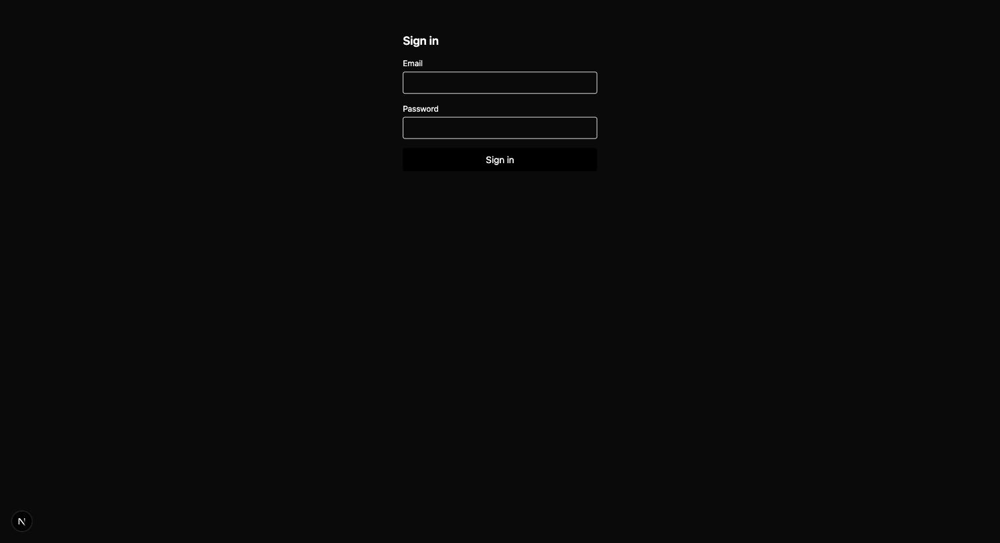

# Scaffold UI baseline — before/after evidence (#487)

Closes the evidence gap #487 flagged against #476: #476 shipped the shadcn/
Tailwind shell/nav/theme/empty-loading-error baseline (PR #505) but landed
with no before/after screenshot, per its own "Evidence" acceptance criterion.

## Method

Real-mode tracer runs (#473) never reached a browsable preview this session
(see `docs/evidence/harness-alignment/defect-list.md`, defects #1-#4), so per
#487's own agent guidance ("mock-mode, if faster to iterate"), this uses the
fastest available route to a genuine before/after: the scaffold itself, at
two real commits, booted with `next dev` and screenshotted in a real browser.
No LLM calls, no orchestrator run — this isolates exactly what #476 changed
(the scaffold template), which is the thing #487 asked to see evidence of.

- **Before**: `harness/scaffolds/nextjs` at `acf5884` (tip of `main` immediately
  before PR #505 merged).
- **After**: `harness/scaffolds/nextjs` at `HEAD` (current, post-#505).
- Both trees extracted via `git archive`, `pnpm install`ed and `pnpm dev`ed
  standalone, with placeholder Supabase env vars (no real Supabase instance
  needed — `/sign-in` is a public route under the scaffold's own middleware,
  so it renders without a database).
- `/sign-in` is the screenshotted route because the scaffold's root
  `layout.tsx` wraps every route — including `/sign-in` — in `<Shell>`, so
  the shell/nav/theme diff is fully visible there without needing an
  authenticated session to reach the home page's `<EmptyState>`.

## Before — `acf5884` (pre-#476)

No shell, no nav, no theme tokens — an unstyled HTML form on the bare page
background, exactly the "each run invents its own layout" problem #487
describes.

## After — `HEAD` (post-#476, PR #505)

Same `/sign-in` page, now wrapped in the scaffold's `Shell`, themed via
shadcn CSS tokens including automatic dark-mode support
(`prefers-color-scheme`), consistent input/button styling.

## Scope note

Per #487: this is not new scope beyond #476 — #476's implementation is
unchanged. This only supplies the missing evidence artifact.
