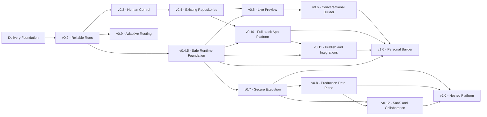

# Agent Foundry Roadmap

> Gerado de `planning/roadmap-spec.json`. Não edite manualmente.

Spec: **2.0.0** · Milestones: **15** · Tasks: **113** · Managed issues: **129**

## Targets

### Personal Builder v1

Transformar um PRD ou change request em uma mudança auditável, executável, revisável e publicável sem exigir uma plataforma SaaS própria.

North star: **Percentual de change requests aceitos sem edição manual de código.**

### Hosted Platform v2

Operar o builder como serviço multiusuário com isolamento, governança, billing, colaboração e SLOs.

North star: **Percentual de runs hospedadas concluídas dentro do SLO sem incidente de isolamento, billing ou perda de dados.**

## Dependency graph

## Milestones

### Delivery Foundation

**Track:** Core · **Target:** Shared · **Commitment:** Now · **Risk:** High

Fonte de verdade, governança, segurança básica e fluxo de entrega antes de ampliar o produto.

**Objective:** Transformar o backlog em um sistema executável de decisão, evidência e aprendizado sem aumentar desnecessariamente o escopo funcional.

**Exit criteria**

- [ ] Roadmap e Project são reproduzíveis por scripts idempotentes e possuem dry-run.
- [ ] CI expõe gates separados e a branch padrão possui proteção compatível com um maintainer solo.
- [ ] Produto pessoal e plataforma hospedada têm contratos e caminhos críticos diferentes.
- [ ] Baseline v0.1.0, DoR/DoD, ADRs, risk register e deployment profiles estão publicados.

**Tasks**

- **foundation-roadmap-source** · P0 · Versionar a fonte do roadmap e detectar drift com o GitHub
- **foundation-delivery-project** · P0 · Criar o GitHub Project Agent Foundry Delivery como painel operacional
- **foundation-delivery-contract** · P0 · Definir Definition of Ready, Definition of Done e contrato de evidência
- **foundation-repo-templates** · P0 · Adicionar Issue Forms, PR template e guia de contribuição
- **foundation-adrs-boundaries** · P0 · Adotar ADRs e impor fronteiras arquiteturais no CI
- **foundation-ci** · P0 · Separar checks de CI e adicionar format, lint, architecture e roadmap gates
- **foundation-repo-security** · P0 · Configurar ruleset, dependency review e atualização segura de dependências
- **foundation-baseline-release** · P1 · Publicar a baseline reproduzível v0.1.0
- **foundation-product-contract** · P1 · Separar Personal Builder v1 de Hosted Platform v2 e definir métricas
- **foundation-risk-profiles** · P1 · Criar registro vivo de riscos e deployment profiles seguros

### v0.2 - Reliable Runs

**Track:** Core · **Target:** Shared · **Commitment:** Now · **Risk:** High

Execuções reais, canceláveis, retomáveis e auditáveis, com recuperação após falhas.

**Objective:** Transformar o MVP batch em um motor confiável. A release valida Codex, Claude e AGY em tarefas reais e torna cada run controlável, retomável e idempotente.

**Exit criteria**

- [ ] Existe ao menos um canário reproduzível por provider e um relatório de baseline.
- [ ] Runs sobrevivem a crash de worker sem duplicar artefatos ou commits.
- [ ] Cancel, pause, resume e retry por step funcionam até o processo da CLI.
- [ ] A UI acompanha o workflow em tempo real e permite diagnosticar cada attempt.

**Tasks**

- **v02-provider-canaries** · P0 · Executar canários reais e congelar o baseline dos três providers
- **v02-run-domain** · P0 · Introduzir WorkflowRun, StepRun e StepAttempt como entidades persistidas
- **v02-queue-leases** · P0 · Adicionar leases, heartbeats, fencing tokens e recuperação de jobs órfãos
- **v02-cancellation** · P0 · Propagar cancelamento até a árvore de processos e restaurar o checkpoint
- **v02-pause-resume** · P0 · Implementar pause e resume seguros em fronteiras de step
- **v02-step-retry** · P0 · Permitir retry de um step com invalidação controlada dos descendentes
- **v02-idempotency** · P0 · Garantir idempotência entre attempts, artefatos, eventos e commits
- **v02-sse-timeline** · P0 · Transmitir eventos por SSE com replay e timeline visual da execução
- **v02-failure-injection** · P1 · Criar suíte de failure injection para crash, timeout, rate limit e entrega duplicada
- **v02-dogfood** · P1 · Usar Agent Foundry para implementar tarefas reais da própria v0.2

### v0.3 - Human Control

**Track:** Core · **Target:** Personal v1 · **Commitment:** Next · **Risk:** Medium

Aprovações humanas, políticas de projeto e limites explícitos de execução.

**Objective:** Dar ao usuário autoridade real sobre decisões, custo e risco. Gates humanos passam a ser artefatos versionados, não mensagens efêmeras.

**Exit criteria**

- [ ] Workflow suporta approval gates pausáveis e retomáveis.
- [ ] Usuário aprova, rejeita ou pede mudanças pela UI com diff e contexto.
- [ ] Políticas de stack, providers, dependências e orçamento são aplicadas antes da execução.
- [ ] Toda decisão humana possui ator, timestamp, razão e efeito auditável.

**Tasks**

- **v03-approval-domain** · P1 · Adicionar approval gates e decisões humanas ao workflow declarativo
- **v03-approval-api-ui** · P1 · Construir API e interface de revisão para aprovar, rejeitar e pedir mudanças
- **v03-project-policies** · P1 · Definir e aplicar ProjectPolicy para stack, providers e dependências
- **v03-budgets-overrides** · P1 · Aplicar budgets e overrides explícitos de modelo por run ou step
- **v03-audit-feedback** · P1 · Persistir feedback humano e identidade do ator na trilha de auditoria
- **v03-policy-e2e** · P1 · Cobrir approval gates e políticas com testes end-to-end

### v0.4 - Existing Repositories

**Track:** Core · **Target:** Personal v1 · **Commitment:** Candidate · **Risk:** High

Importação de repositórios, worktrees isolados e change requests incrementais.

**Objective:** Parar de tratar todo pedido como greenfield. O Agent Foundry passa a entender um baseline Git, selecionar contexto e aplicar mudanças incrementais sem corromper o branch original.

**Exit criteria**

- [ ] Projeto pode nascer de um repositório Git e commit base explícito.
- [ ] Cada run mutável usa branch e worktree próprios.
- [ ] Context builder seleciona arquivos por tarefa com orçamento auditável.
- [ ] Usuário envia change requests e revisa diff antes de promover.

**Tasks**

- **v04-repository-source** · P1 · Modelar RepositorySource e importar um baseline Git de forma segura
- **v04-git-credentials** · P1 · Criar fronteira de credenciais Git sem vazar tokens para agentes
- **v04-worktrees** · P1 · Isolar cada run mutável em branch e Git worktree próprios
- **v04-repository-map** · P1 · Gerar repository-map com módulos, configs, símbolos e grafo de imports
- **v04-context-selector** · P1 · Selecionar contexto por tarefa usando busca lexical, imports e orçamento
- **v04-change-requests** · P1 · Introduzir ChangeRequest e workflow incremental sobre um baseline
- **v04-diff-review** · P1 · Adicionar file browser, diff review e promoção do branch na interface

### v0.4.5 - Safe Runtime Foundation

**Track:** Safety · **Target:** Shared · **Commitment:** Next · **Risk:** Critical

Fronteira mínima de execução antes de verifier e preview de código gerado.

**Objective:** Impedir que Live Preview execute código gerado com o filesystem, secrets, rede e privilégios do host.

**Exit criteria**

- [ ] Verifier e preview só executam através de SandboxRunner.
- [ ] O backend rootless é efêmero, limitado e sem home/credentials do host.
- [ ] Egress inicia bloqueado e artifacts atravessam uma fronteira validada e redigida.
- [ ] Canários adversariais falham fora do sandbox e não deixam recursos órfãos.

**Tasks**

- **v045-sandbox-runner-seam** · P0 · Introduzir SandboxRunner antes de verifier e preview
- **v045-rootless-container** · P0 · Executar jobs em container rootless e efêmero
- **v045-host-isolation** · P0 · Remover acesso ao home, credenciais e sockets do host
- **v045-resource-limits** · P0 · Aplicar limites de CPU, memória, PIDs, disco e tempo
- **v045-egress-policy** · P0 · Bloquear egress por padrão durante verifier e preview
- **v045-artifact-boundary** · P0 · Coletar artifacts e logs por uma fronteira redigida
- **v045-adversarial-canaries** · P0 · Criar canários adversariais para filesystem, rede e processos

### v0.5 - Live Preview

**Track:** UX · **Target:** Personal v1 · **Commitment:** Candidate · **Risk:** High

Preview executável, logs de browser e verificação Playwright reproduzível.

**Objective:** Fechar o ciclo entre geração e comportamento visível. Cada run pode subir uma aplicação temporária, testá-la em browser e entregar evidência visual.

**Exit criteria**

- [ ] Aplicações suportadas ganham preview URL temporária e lifecycle controlado.
- [ ] Playwright valida jornadas e produz screenshots, trace e console.
- [ ] A UI alterna desktop/mobile e mostra logs do runtime e do browser.
- [ ] Preview quebrado vira input estruturado para repair.

**Tasks**

- **v05-preview-domain** · P1 · Definir PreviewSession e a porta PreviewRunner
- **v05-runtime-detection** · P1 · Detectar package manager e comandos de install, build e dev
- **v05-preview-network** · P1 · Descobrir porta e expor preview por reverse proxy com isolamento básico
- **v05-preview-lifecycle** · P1 · Gerenciar health, restart, timeout e coleta de logs do preview
- **v05-playwright** · P1 · Adicionar BrowserVerifier com Playwright e test plans versionados
- **v05-preview-artifacts** · P1 · Persistir screenshots, trace, vídeo opcional e logs como artifacts
- **v05-preview-ui-e2e** · P1 · Construir painel de preview responsivo e fechar golden flow end-to-end

### v0.6 - Conversational Builder

**Track:** UX · **Target:** Personal v1 · **Commitment:** Candidate · **Risk:** Medium

Chat iterativo, modos Plan/Build, version history e edição visual ligada ao código.

**Objective:** Mudar a experiência de PRD batch para um builder iterativo. Conversa, preview e diff passam a compartilhar o mesmo contexto versionado.

**Exit criteria**

- [ ] Usuário alterna Plan e Build sem perder contexto.
- [ ] Cada mensagem gera uma operação rastreável e pode incluir imagem ou seleção visual.
- [ ] Versões podem ser comparadas, revertidas e ramificadas.
- [ ] Seleção de componente no preview produz patch de código verificável.

**Tasks**

- **v06-conversation-domain** · P1 · Modelar Conversation, Message, Attachment e Operation
- **v06-plan-build-modes** · P1 · Implementar modos Plan e Build com contratos de saída distintos
- **v06-chat-operations** · P1 · Converter mensagens em change requests incrementais e handoffs reproduzíveis
- **v06-chat-streaming** · P1 · Transmitir tokens, tool calls e progresso dos agentes dentro do chat
- **v06-version-history** · P1 · Adicionar version history, compare, revert e branch de uma versão
- **v06-dom-source-map** · P1 · Mapear elemento selecionado no preview para componente e origem no código
- **v06-visual-patches** · P1 · Aplicar edições visuais como patches estruturados e verificáveis
- **v06-knowledge-attachments-shell** · P1 · Adicionar knowledge files, imagens e shell de três painéis do builder

### v0.10 - Full-stack App Platform

**Track:** Integrations · **Target:** Personal v1 · **Commitment:** Candidate · **Risk:** High

Ambientes por projeto com banco, auth, storage, functions, secrets e portabilidade.

**Objective:** Entregar o equivalente funcional de um backend gerenciado para os apps produzidos, sem misturar o control plane do Agent Foundry com o runtime do app.

**Exit criteria**

- [ ] Projeto pode provisionar ambiente full-stack isolado.
- [ ] Agente cria schema, auth, storage e functions com migrations revisáveis.
- [ ] Secrets e integrações são scoped por projeto.
- [ ] Usuário consegue exportar código e dados sem lock-in obrigatório.

**Tasks**

- **v010-environment-provisioner** · P1 · Definir AppEnvironment e a porta EnvironmentProvisioner
- **v010-database** · P1 · Provisionar PostgreSQL por projeto e gerenciar schema por migrations
- **v010-auth** · P1 · Integrar autenticação e gerar fluxos seguros de usuário
- **v010-storage** · P1 · Provisionar storage de arquivos com policies e uploads seguros
- **v010-functions** · P1 · Adicionar runtime de serverless/edge functions com deploy versionado
- **v010-app-secrets** · P1 · Criar secret store e runtime de conexões por projeto
- **v010-data-security** · P1 · Verificar RLS, autorização e operações destrutivas antes de release
- **v010-fullstack-reference** · P1 · Entregar workflow e app de referência full-stack com export portátil

### v0.11 - Publish and Integrations

**Track:** Integrations · **Target:** Personal v1 · **Commitment:** Candidate · **Risk:** High

Publicação, domínios, GitHub two-way sync e conectores externos.

**Objective:** Levar o projeto de preview a produto publicado, preservando propriedade do código e integração com ferramentas externas.

**Exit criteria**

- [ ] Versões podem ser promovidas para production e revertidas.
- [ ] Custom domain e TLS possuem verificação e status claros.
- [ ] GitHub mantém sync bidirecional com política de conflitos.
- [ ] Connector SDK suporta pelo menos pagamentos e email como referências.

**Tasks**

- **v011-deployment-domain** · P1 · Definir Release, Deployment e a porta DeploymentProvider
- **v011-publish-domains** · P1 · Implementar publish pipeline, custom domains e TLS
- **v011-github-app** · P1 · Integrar GitHub App/OAuth com permissões mínimas por repositório
- **v011-github-sync** · P1 · Implementar two-way sync, pull requests e resolução de conflitos
- **v011-connector-sdk** · P1 · Criar Connector SDK com OAuth, scopes, actions e secret refs
- **v011-reference-connectors** · P1 · Entregar conectores de referência para Stripe e email transacional
- **v011-release-ui-e2e** · P1 · Construir painel de releases, domains, GitHub e connectors com golden flow

### v1.0 - Personal Builder

**Track:** UX · **Target:** Personal v1 · **Commitment:** Candidate · **Risk:** Critical

Release pessoal Lovable-class: intenção até preview, feedback, GitHub e publicação, sem depender do SaaS multi-tenant.

**Objective:** Entregar a experiência de builder pessoal completa e verificável antes de escalar para Hosted Platform.

**Exit criteria**

- [ ] Golden journeys cobrem prompt -> app full-stack -> visual edit -> deploy -> GitHub.
- [ ] Feature contract e non-goals estão públicos e verificáveis.
- [ ] SLOs, segurança, privacy e suporte possuem gates de lançamento.
- [ ] Onboarding leva um usuário novo a um app publicado sem intervenção da equipe.

**Tasks**

- **v100-parity-contract** · P1 · Publicar feature contract e matriz Lovable-class
- **v100-onboarding-templates** · P1 · Construir onboarding, template gallery e remix guiado
- **v100-builder-polish** · P1 · Polir builder, acessibilidade, responsividade e performance percebida
- **v100-golden-journeys** · P1 · Automatizar golden journeys ponta a ponta em ambiente semelhante à produção
- **v100-reliability-ops** · P1 · Definir SLOs, capacity model, runbooks e incident readiness
- **v100-security-privacy** · P1 · Concluir security review, privacy review e launch threat assessment
- **v100-launch** · P1 · Fechar pricing UX, documentação, migração e automação de release

### v0.7 - Secure Execution

**Track:** Safety · **Target:** Hosted v2 · **Commitment:** Candidate · **Risk:** Critical

Control plane separado, sandboxes efêmeros e políticas de recursos, rede e segredos.

**Objective:** Parar de executar código gerado com os privilégios do host. Criar uma fronteira operacional concreta antes de aceitar entradas não confiáveis.

**Exit criteria**

- [ ] Cada run hosted acontece em sandbox efêmero sem credenciais reutilizáveis.
- [ ] Filesystem, processos, CPU, memória, disco e rede possuem limites.
- [ ] Secrets entram por broker de curta duração e passam por redaction.
- [ ] Threat model e testes adversariais cobrem escape, exfiltração e cleanup.

**Tasks**

- **v07-control-execution-plane** · P1 · Separar control plane e execution plane por um protocolo explícito
- **v07-sandbox-runner** · P1 · Definir SandboxRunner e lifecycle create, exec, snapshot e destroy
- **v07-container-backend** · P1 · Implementar backend de sandbox em container rootless
- **v07-network-policy** · P1 · Bloquear rede por padrão e liberar egress por policy
- **v07-secret-broker** · P1 · Entregar secrets efêmeros por broker e redigir saídas
- **v07-cache-supply-chain** · P1 · Criar cache seguro de dependências e controles básicos de supply chain
- **v07-threat-model** · P1 · Publicar threat model e suíte adversarial de isolamento

### v0.8 - Production Data Plane

**Track:** Hosted · **Target:** Hosted v2 · **Commitment:** Candidate · **Risk:** High

PostgreSQL, object storage, fila durável, observabilidade e recuperação operacional.

**Objective:** Trocar adapters locais por uma implementação transacional e distribuível sem contaminar o domínio.

**Exit criteria**

- [ ] Metadados críticos vivem em PostgreSQL com migrations e constraints.
- [ ] Blobs grandes usam object storage e links assinados.
- [ ] Fila possui leases transacionais, backpressure e outbox.
- [ ] Tracing conecta request, job, run, step, attempt, provider e deploy.

**Tasks**

- **v08-postgres** · P2 · Implementar schema PostgreSQL e adapters das portas de domínio
- **v08-object-storage** · P2 · Mover blobs grandes para object storage com integridade e retenção
- **v08-durable-queue** · P1 · Implementar fila de produção com leases, retry e transactional outbox
- **v08-event-fanout** · P1 · Distribuir eventos e SSE sem depender do filesystem local
- **v08-scheduler** · P1 · Adicionar scheduler de workers, concorrência e backpressure por recurso
- **v08-observability** · P1 · Instrumentar logs, métricas e traces com OpenTelemetry
- **v08-ops-migration** · P1 · Entregar backup, restore, retenção e migração do storage local

### v0.12 - SaaS and Collaboration

**Track:** Hosted · **Target:** Hosted v2 · **Commitment:** Exploratory · **Risk:** High

Autenticação, workspaces, RBAC, colaboração, créditos e billing.

**Objective:** Transformar a ferramenta pessoal em plataforma multi-tenant operável, com isolamento de dados, colaboração e modelo econômico explícito.

**Exit criteria**

- [ ] Usuários e workspaces possuem RBAC aplicado em todas as portas.
- [ ] Quotas e créditos impedem consumo não autorizado.
- [ ] Billing e usage ledger reconciliam sem alterar histórico.
- [ ] Colaboração, compartilhamento e data rights funcionam por tenant.

**Tasks**

- **v012-identity** · P2 · Adicionar identidade, sessão e proteção de endpoints
- **v012-workspaces-rbac** · P2 · Modelar workspaces, memberships e RBAC por projeto
- **v012-tenant-isolation** · P2 · Aplicar isolamento de tenant em banco, fila, blobs e sandboxes
- **v012-collaboration** · P1 · Adicionar colaboradores, comentários, presence e atividade
- **v012-sharing-templates** · P1 · Implementar sharing, remix e templates com proveniência
- **v012-usage-credits** · P1 · Criar usage ledger, quotas e créditos por workspace
- **v012-billing-connections** · P1 · Integrar billing e ownership de secrets/connections por workspace
- **v012-governance-e2e** · P1 · Entregar audit, abuse controls, data rights e suíte multi-tenant

### v2.0 - Hosted Platform

**Track:** Hosted · **Target:** Hosted v2 · **Commitment:** Exploratory · **Risk:** Critical

Release multi-tenant operável, segura, mensurável e financeiramente reconciliável.

**Objective:** Transformar o Personal Builder em serviço hospedado sem colocar billing e multi-tenancy no caminho crítico da Personal v1.

**Exit criteria**

- [ ] Golden journeys multi-tenant e colaboração passam com isolamento negativo.
- [ ] Abuse review, pentest, incident readiness e launch blockers críticos foram concluídos.
- [ ] Billing, ledger e reconciliação financeira funcionam ponta a ponta.
- [ ] SLOs, capacidade, restore, migração e suporte inicial foram exercitados.

**Tasks**

- **v200-hosted-contract** · P2 · Publicar o feature contract e os non-goals da Hosted Platform v2
- **v200-multitenant-journeys** · P2 · Automatizar golden journeys multi-tenant e de colaboração
- **v200-abuse-security** · P2 · Concluir abuse review, pentest e incident readiness
- **v200-billing-reconciliation** · P2 · Validar ledger, billing e reconciliação financeira ponta a ponta
- **v200-slo-capacity** · P1 · Validar SLOs, capacity model e recuperação do serviço hospedado
- **v200-migration-support** · P1 · Entregar migração do Personal Builder e suporte operacional inicial
- **v200-launch-gates** · P1 · Executar os launch gates da Hosted Platform v2

### v0.9 - Adaptive Routing

**Track:** Research · **Target:** Shared · **Commitment:** Exploratory · **Risk:** Medium

Benchmarks próprios, telemetria normalizada e roteamento com confiança e guardrails.

**Objective:** Trocar priors subjetivos por decisões baseadas em evidência do próprio workload, sem entregar o controle a uma caixa-preta prematura.

**Exit criteria**

- [ ] Taxonomia diferencia tarefas e riscos relevantes.
- [ ] Benchmark reproduzível mede qualidade, tempo e consumo até aprovação.
- [ ] Router reporta score, confiança, sample size e razão.
- [ ] Exploração é controlada e proibida em tarefas de alto risco.

**Tasks**

- **v09-task-taxonomy** · P2 · Expandir TaskKind para uma taxonomia hierárquica e versionada
- **v09-usage-telemetry** · P2 · Normalizar tokens, custo, quota e rate limits entre providers
- **v09-benchmark-runner** · P2 · Criar corpus de tarefas e benchmark runner reproduzível
- **v09-quality-signals** · P2 · Combinar checks determinísticos, blind review e feedback humano em quality signals
- **v09-confidence-routing** · P3 · Adicionar confiança, sample size e calibração à decisão do router
- **v09-exploration-health** · P3 · Implementar exploração controlada, circuit breakers e provider health
- **v09-router-dashboard** · P3 · Construir dashboard de router e registry de experimentos
